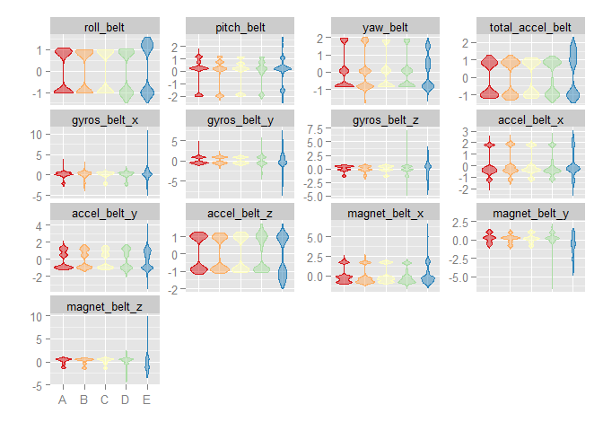
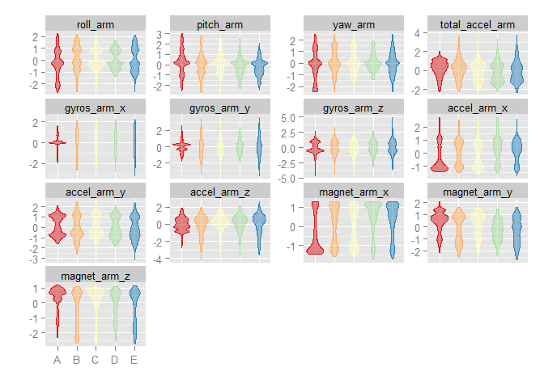
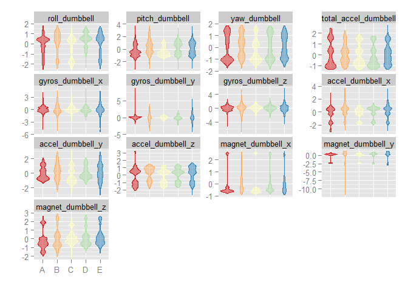
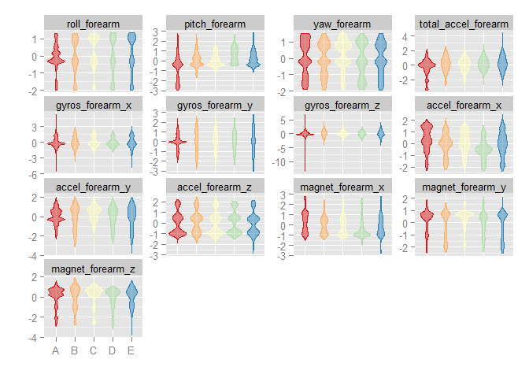

# Coursera: Practical Machine Learning Prediction Assignment

# Read data

Read the training data into a data table D.

```r
require(data.table)
filepath <- "./data/pml-training.csv"
D <- fread(filepath)
```
Read the testing data into a data table DTest.

```r
filepath <- "./data/pml-testing.csv"
DTest <- fread(filepath)
```
Search for columns with missing values in DTest.

Belt, arm, dumbbell, and forearm columns without missing values in DTest will be **predictor candidates**. There are 52 columns as listed below. 

```r
isMissingColumn <- sapply(DTest, function (x) any(is.na(x) | x == ""))
isPredictor <- !isMissingColumn & grepl("belt|[^(fore)]arm|dumbbell|forearm", names(isMissingColumn))
predCandidates <- names(isMissingColumn)[isPredictor]
predCandidates
```

```
## [1] "roll_belt"            "pitch_belt"           "yaw_belt"             "total_accel_belt"    
## [5] "gyros_belt_x"         "gyros_belt_y"         "gyros_belt_z"         "accel_belt_x"        
## [9] "accel_belt_y"         "accel_belt_z"         "magnet_belt_x"        "magnet_belt_y"       
##[13] "magnet_belt_z"        "roll_arm"             "pitch_arm"            "yaw_arm"             
##[17] "total_accel_arm"      "gyros_arm_x"          "gyros_arm_y"          "gyros_arm_z"         
##[21] "accel_arm_x"          "accel_arm_y"          "accel_arm_z"          "magnet_arm_x"        
##[25] "magnet_arm_y"         "magnet_arm_z"         "roll_dumbbell"        "pitch_dumbbell"      
##[29] "yaw_dumbbell"         "total_accel_dumbbell" "gyros_dumbbell_x"     "gyros_dumbbell_y"    
##[33] "gyros_dumbbell_z"     "accel_dumbbell_x"     "accel_dumbbell_y"     "accel_dumbbell_z"    
##[37] "magnet_dumbbell_x"    "magnet_dumbbell_y"    "magnet_dumbbell_z"    "roll_forearm"        
##[41] "pitch_forearm"        "yaw_forearm"          "total_accel_forearm"  "gyros_forearm_x"     
##[45] "gyros_forearm_y"      "gyros_forearm_z"      "accel_forearm_x"      "accel_forearm_y"     
##[49] "accel_forearm_z"      "magnet_forearm_x"     "magnet_forearm_y"     "magnet_forearm_z" 
```

Subset the primary dataset to include only the **predictor candidates** and the outcome variable, `classe`. There will be 53 columns in total. 

```r
varToInclude <- c("classe", predCandidates)
D <- D[, varToInclude, with=FALSE]
dim(D)
```

```
## [1] 19622    53
```

Convert `classe` into a factor.

```r
D <- D[, classe := factor(D[, classe])]
D[, .N, classe]

##    classe    N
## 1:      A 5580
## 2:      B 3797
## 3:      C 3422
## 4:      D 3216
## 5:      E 3607
```

Split the dataset into a 60% training and 40% probing/testing dataset.

```r
require(caret)
set.seed(123456)
inTrain <- createDataPartition(D$classe, p=0.6)
DTrain <- D[inTrain[[1]]]
DProbe <- D[-inTrain[[1]]]
```

Preprocess the predictors by centering and scaling.

```r
X <- DTrain[, predCandidates, with=FALSE]
preProc <- preProcess(X)
preProc
```

```
## 
## Call:
## preProcess.default(x = X)
## 
## Created from 11776 samples and 52 variables
## Pre-processing: centered, scaled
```

```r
XCS <- predict(preProc, X)
DTrainCS <- data.table(data.frame(classe = DTrain[, classe], XCS))
```

Apply the centering and scaling to the probing/testing dataset.


```r
X <- DProbe[, predCandidates, with=FALSE]
XCS <- predict(preProc, X)
DProbeCS <- data.table(data.frame(classe = DProbe[, classe], XCS))
```

Check for near zero variance in DTrainCS.

```r
nzv <- nearZeroVar(DTrainCS, saveMetrics=TRUE)
if (any(nzv$nzv)) nzv else message("No variables with near zero variance")
```

```
## No variables with near zero variance
```

Visulization groups of predictors.


```r
histGroup <- function (data, regex) {
  col <- grep(regex, names(data))
  col <- c(col, which(names(data) == "classe"))
  require(reshape2)
  n <- nrow(data)
  DMelted <- melt(data[, col, with=FALSE][, rownum := seq(1, n)], id.vars=c("rownum", "classe"))
  require(ggplot2)
  ggplot(DMelted, aes(x=classe, y=value)) +
    geom_violin(aes(color=classe, fill=classe), alpha=1/2) +
    #     geom_jitter(aes(color=classe, fill=classe), alpha=1/10) +
    #     geom_smooth(aes(group=1), method="gam", color="black", alpha=1/2, size=2) +
    facet_wrap(~ variable, scale="free_y") +
    scale_color_brewer(palette="Spectral") +
    scale_fill_brewer(palette="Spectral") +
    labs(x="", y="") +
    theme(legend.position="none")
}
histGroup(DTrainCS, "belt")
```

 

```r
histGroup(DTrainCS, "[^(fore)]arm")
```

 

```r
histGroup(DTrainCS, "dumbbell")
```

 

```r
histGroup(DTrainCS, "forearm")
```

 


# Train a prediction model using Random Forest

Set up the parallel clusters.

```r
require(parallel)
require(doParallel)
cl <- makeCluster(detectCores() - 1)
registerDoParallel(cl)
```

Set the control parameters.

```r
ctrl <- trainControl(classProbs=TRUE,
                     savePredictions=TRUE,
                     allowParallel=TRUE)
```

Fit model over the tuning parameters.

```r
method <- "rf"
system.time(trainingModel <- train(classe ~ ., data=DTrainCS, method=method))
```

```
##  user  system elapsed 
##  39.06    0.56 1323.30 
```

Stop the clusters.

```r
stopCluster(cl)
```

## Evaluate the model on the training dataset


```r
trainingModel
```

```
## Random Forest 
## 
## 11776 samples
##    52 predictor
##     5 classes: 'A', 'B', 'C', 'D', 'E' 
## 
## No pre-processing
## Resampling: Bootstrapped (25 reps) 
## 
## Summary of sample sizes: 11776, 11776, 11776, 11776, 11776, 11776, ... 
## 
## Resampling results across tuning parameters:
## 
##  mtry  Accuracy   Kappa      Accuracy SD  Kappa SD   
##   2    0.9866865  0.9831573  0.002898794  0.003666348
##  27    0.9865829  0.9830264  0.002358093  0.002988144
##  52    0.9754671  0.9689647  0.004773163  0.006045727
## 
## Accuracy was used to select the optimal model using  the largest value.
## The final value used for the model was mtry = 2.
```

```r
hat <- predict(trainingModel, DTrainCS)
confusionMatrix(hat, DTrain[, classe])
```

```
## Confusion Matrix and Statistics
## 
##           Reference
## Prediction    A    B    C    D    E
##          A 3348    0    0    0    0
##          B    0 2279    0    0    0
##          C    0    0 2054    0    0
##          D    0    0    0 1930    0
##          E    0    0    0    0 2165
## 
## Overall Statistics
##                                 
##                Accuracy : 1     
##                  95% CI : (0.9997, 1)
##     No Information Rate : 0.2843 
##     P-Value [Acc > NIR] : <2.2e-16
##                                 
##                   Kappa : 1     
##  Mcnemar's Test P-Value : NA    
## 
## Statistics by Class:
## 
##                      Class: A Class: B Class: C Class: D Class: E
## Sensitivity             1.000    1.000    1.000    1.000    1.000
## Specificity             1.000    1.000    1.000    1.000    1.000
## Pos Pred Value          1.000    1.000    1.000    1.000    1.000
## Neg Pred Value          1.000    1.000    1.000    1.000    1.000
## Prevalence              0.284    0.194    0.174    0.164    0.184
## Detection Rate          0.284    0.194    0.174    0.164    0.184
## Detection Prevalence    0.284    0.194    0.174    0.164    0.184
## Balanced Accuracy       1.000    1.000    1.000    1.000    1.000
```

## Evaluate the model on the probing dataset


```r
hat <- predict(trainingModel, DProbeCS)
confusionMatrix(hat, DProbeCS[, classe])
```

```
## Confusion Matrix and Statistics
## 
##           Reference
## Prediction    A    B    C    D    E
##          A 2229   15    0    0    0
##          B    0 1496    9    0    0
##          C    3    7 1353   35    1
##          D    0    0    6 1251    2
##          E    0    0    0    0 1439
## 
## Overall Statistics
##                                         
##                Accuracy : 0.9901         
##                  95% CI : (0.9876, 0.9921)
##     No Information Rate : 0.2845         
##     P-Value [Acc > NIR] : <2.2e-16        
##                                         
##                   Kappa : 0.9874        
##  Mcnemar's Test P-Value : NA            
## 
## Statistics by Class:
## 
##                      Class: A Class: B Class: C Class: D Class: E
## Sensitivity            0.9987   0.9855   0.9890   0.9728   0.9979
## Specificity            0.9973   0.9986   0.9929   0.9988   1.0000
## Pos Pred Value         0.9933   0.9940   0.9671   0.9936   1.0000
## Neg Pred Value         0.9995   0.9965   0.9977   0.9947   0.9995
## Prevalence             0.2845   0.1935   0.1744   0.1639   0.1838
## Detection Rate         0.2841   0.1907   0.1724   0.1594   0.1834
## Detection Prevalence   0.2860   0.1918   0.1783   0.1605   0.1834
## Balanced Accuracy      0.9980   0.9920   0.9910   0.9858   0.9990
```

## Display the final model

```r
varImp(trainingModel)
```

```
# rf variable importance
# 
#   only 20 most important variables shown (out of 52)
# 
#                   Overall
# roll_belt          100.00
# yaw_belt            80.19
# magnet_dumbbell_z   72.52
# magnet_dumbbell_y   63.48
# pitch_belt          63.12
# pitch_forearm       61.08
# magnet_dumbbell_x   58.12
# roll_forearm        51.72
# accel_belt_z        49.62
# magnet_belt_y       46.73
# magnet_belt_z       45.40
# accel_dumbbell_y    43.60
# roll_dumbbell       43.44
# accel_dumbbell_z    39.68
# roll_arm            35.25
# accel_forearm_x     33.63
# yaw_dumbbell        30.10
# gyros_belt_z        28.81
# magnet_arm_y        28.61
# accel_arm_x         28.23
```

```r
trainingModel$finalModel
```

```
# Call:
#  randomForest(x = x, y = y, mtry = param$mtry) 
#                Type of random forest: classification
#                      Number of trees: 500
# No. of variables tried at each split: 2
# 
#         OOB estimate of  error rate: 0.86%
# Confusion matrix:
#      A    B    C    D    E class.error
# A 3342    2    2    0    2 0.001792115
# B   20 2251    8    0    0 0.012286090
# C    0   21 2028    5    0 0.012658228
# D    0    0   33 1896    1 0.017616580
# E    0    0    2    5 2158 0.003233256
```

**The estimated error rate is less than 1%.**
  
  Save training model object for later.


```r
save(trainingModel, file="trainingModel.RData")
```


# Predict on the test data

Load the training model.


```r
load(file="trainingModel.RData", verbose=TRUE)
```

```
## Loading objects:
##   trainingModel
```

Get predictions and evaluate.

```r
DTestCS <- predict(preProc, DTest[, predCandidates, with=FALSE])
hat <- predict(trainingModel, DTestCS)
DTest <- cbind(hat , DTest)
subset(DTest, select=names(DTest)[grep("belt|[^(fore)]arm|dumbbell|forearm", names(DTest), invert=TRUE)])
```

```
#     hat V1 user_name raw_timestamp_part_1 raw_timestamp_part_2   cvtd_timestamp new_window num_window problem_id
#  1:   B  1     pedro           1323095002               868349 05/12/2011 14:23         no         74          1
#  2:   A  2    jeremy           1322673067               778725 30/11/2011 17:11         no        431          2
#  3:   B  3    jeremy           1322673075               342967 30/11/2011 17:11         no        439          3
#  4:   A  4    adelmo           1322832789               560311 02/12/2011 13:33         no        194          4
#  5:   A  5    eurico           1322489635               814776 28/11/2011 14:13         no        235          5
#  6:   E  6    jeremy           1322673149               510661 30/11/2011 17:12         no        504          6
#  7:   D  7    jeremy           1322673128               766645 30/11/2011 17:12         no        485          7
#  8:   B  8    jeremy           1322673076                54671 30/11/2011 17:11         no        440          8
#  9:   A  9  carlitos           1323084240               916313 05/12/2011 11:24         no        323          9
# 10:   A 10   charles           1322837822               384285 02/12/2011 14:57         no        664         10
# 11:   B 11  carlitos           1323084277                36553 05/12/2011 11:24         no        859         11
# 12:   C 12    jeremy           1322673101               442731 30/11/2011 17:11         no        461         12
# 13:   B 13    eurico           1322489661               298656 28/11/2011 14:14         no        257         13
# 14:   A 14    jeremy           1322673043               178652 30/11/2011 17:10         no        408         14
# 15:   E 15    jeremy           1322673156               550750 30/11/2011 17:12         no        779         15
# 16:   E 16    eurico           1322489713               706637 28/11/2011 14:15         no        302         16
# 17:   A 17     pedro           1323094971               920315 05/12/2011 14:22         no         48         17
# 18:   B 18  carlitos           1323084285               176314 05/12/2011 11:24         no        361         18
# 19:   B 19     pedro           1323094999               828379 05/12/2011 14:23         no         72         19
# 20:   B 20    eurico           1322489658               106658 28/11/2011 14:14         no        255         20
```

## Submission to Coursera

Write submission files to `images/`.


```r
pml_write_files = function(x){
  n = length(x)
  path <- "images/"
  for(i in 1:n){
    filename = paste0("problem_id_",i,".txt")
    write.table(x[i],file=file.path(path, filename),quote=FALSE,row.names=FALSE,col.names=FALSE)
  }
}
pml_write_files(hat)
```